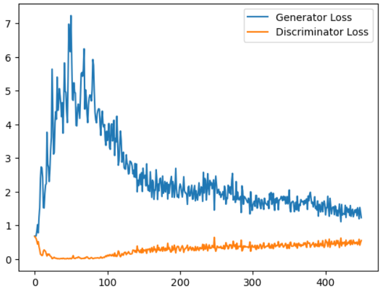
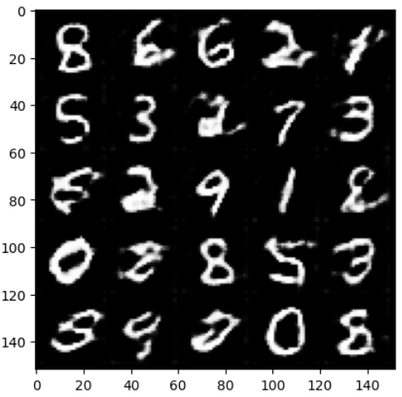

# Conditional DCGAN (Conditional Deep Convolutional Generative Adversarial Networks)
## Background

Conditional DCGAN is an extension of the original DCGAN architecture that incorporates the concept of conditional generation. It allows you to generate samples based on specific conditions or labels, enabling control over the characteristics of the generated data. By conditioning the generator on additional input information, such as class labels, you can generate images with desired attributes or belonging to specific classes.

DCGAN is a type of GAN that utilizes deep convolutional neural networks for both the generator and discriminator. It has been widely used for generating realistic images.
## About

This repository contains an implementation of Conditional DCGAN using the PyTorch deep learning framework. It includes both the generator and discriminator networks, along with the necessary training code to train the model on your own dataset with conditional generation.

The architecture of the conditional DCGAN is similar to DCGAN, but with an additional conditioning variable incorporated in both the generator and discriminator networks.
## Generator

The generator, G, is designed to map the latent space vector (z) and conditioning variable (c) to data-space. The latent space vector captures the random noise, while the conditioning variable provides additional information to guide the generation process. In the case of DCGAN, the generator consists of a series of transposed convolutional layers with batch normalization and ReLU activation functions. The output layer of the generator usually employs a Tanh activation to map the generated data to the desired output range, such as [-1, 1] for images.

## Discriminator

The discriminator, D, is a convolutional neural network that takes an image and conditioning variable as input and predicts whether the input is real or fake. The discriminator architecture typically involves a series of convolutional layers with batch normalization and LeakyReLU activation functions, followed by a sigmoid activation function to produce the final probability.

## Results

I trained Conditional DCGAN for 20 epochs over the MNIST dataset. Following is the progress of losses of generator and discriminator during training:

After training, on inputing random noise vectors along with labels, following were the fake images generated by the model: 

