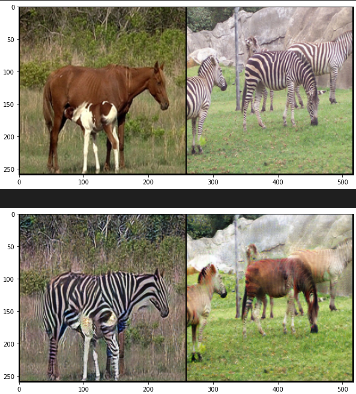
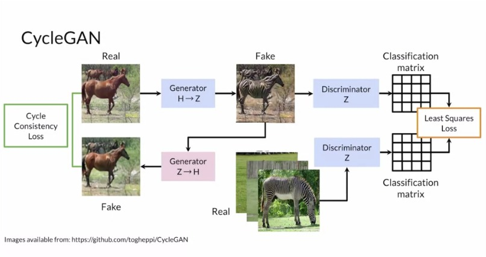

# CycleGAN - Image-to-Image Translation with PyTorch

## Overview

This repository contains an implementation of CycleGAN using PyTorch. CycleGAN is a type of generative adversarial network (GAN) that can learn to translate images from one domain to another without paired training data. It can be used for various image-to-image translation tasks, such as transforming horses to zebras, apples to oranges, and more.

The project is inspired by the paper: [Unpaired Image-to-Image Translation using Cycle-Consistent Adversarial Networks](https://arxiv.org/abs/1703.10593).

## Dataset

The dataset used for training and testing the CycleGAN model is the Horse-to-Zebra dataset.

## Model Architecture

The CycleGAN consists of two generators (G_A and G_B) and two discriminators (D_A and D_B). The generators are responsible for transforming images from domain A to domain B and vice versa, while the discriminators aim to distinguish between real and translated images. The model uses the cycle consistency loss to ensure that the translation is consistent in both directions.

## Training

I trained the model for roughly 10,000 epochs. The image at the top is output of my trained model.

