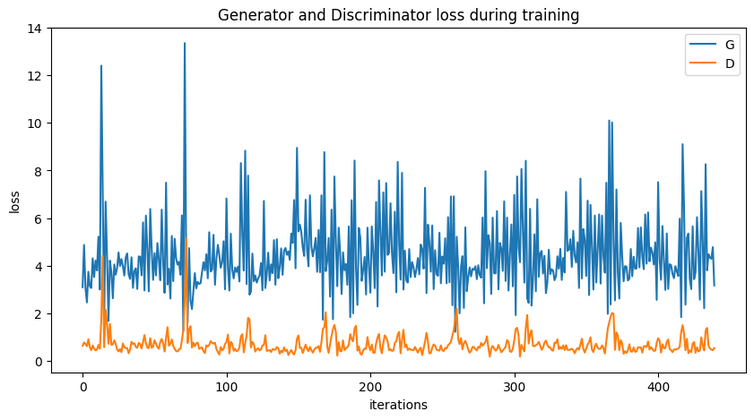
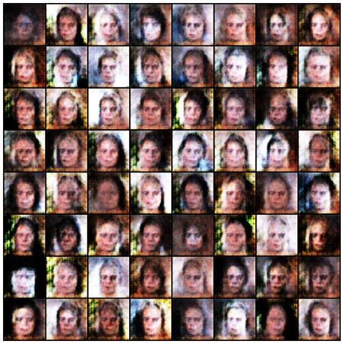

# DCGAN (Deep Convolutional Generative Adversarial Network)

The `dcgan.ipynb` file contains an implementation of a DCGAN (Deep Convolutional Generative Adversarial Network) for generating realistic images. DCGANs are a class of generative models that use deep convolutional neural networks to generate new samples that resemble a given training dataset. The generator and discriminator networks are trained in an adversarial manner, where the generator aims to produce realistic images, while the discriminator tries to differentiate between real and generated images.

## How DCGAN Works

DCGANs consist of two main components: the generator and the discriminator.

- The generator network takes random noise as input and generates fake images. 
- The discriminator network receives both real images from the dataset and fake images from the generator as input, and its role is to classify whether the input images are real or fake.

The generator and discriminator networks are trained together in an adversarial manner. The goal is for the generator to produce images that are so realistic that the discriminator cannot distinguish them from real images. This adversarial training process leads to the generator learning to produce higher-quality images over time.

## Generator
The generator, G, is designed to map the latent space vector (z) to data-space. Since our data are images, converting z to data-space means ultimately creating a RGB image with the same size as the training images (i.e. 3x64x64). In practice, this is accomplished through a series of strided two dimensional convolutional transpose layers, each paired with a 2d batch norm layer and a relu activation. The output of the generator is fed through a tanh function to return it to the input data range of [−1,1]. It is worth noting the existence of the batch norm functions after the conv-transpose layers, as this is a critical contribution of the DCGAN paper. These layers help with the flow of gradients during training. An image of the generator from the DCGAN paper is shown below.

## Discriminator
The discriminator, D, is a binary classification network that takes an image as input and outputs a scalar probability that the input image is real (as opposed to fake). Here, D takes a 3x64x64 input image, processes it through a series of Conv2d, BatchNorm2d, and LeakyReLU layers, and outputs the final probability through a Sigmoid activation function.

## Dataset 
For this project, I used the [Celeb-A Faces dataset](http://mmlab.ie.cuhk.edu.hk/projects/CelebA.html) which can be downloaded at the linked site.

## Results
The training process involved iteratively updating the weights of the generator and discriminator networks. Here is the result of training the GAN:

Follwing are some of the fake images generated by the model:

