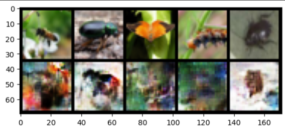
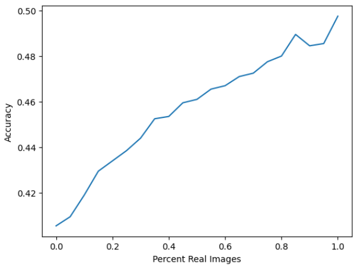

# Data Augmentation using GANs for CIFAR-100

## Project Description

This project aims to improve the performance of a CIFAR-100 image classifier using data augmentation through Generative Adversarial Networks (GANs). By training a GAN on the CIFAR-100 dataset and generating fake data, I enhanced the classifier's ability to generalize to unseen examples.

## Goal

I built a generator that can be used to help create data to train a classifier. There are many cases where this might be useful. If you are interested in any of these topics, you are welcome to explore the linked papers and articles! 

-   With smaller datasets, GANs can provide useful data augmentation that substantially [improve classifier performance](https://arxiv.org/abs/1711.04340). 
-   You have one type of data already labeled and would like to make predictions on [another related dataset for which you have no labels](https://www.nature.com/articles/s41598-019-52737-x). (You'll learn about the techniques for this use case in future notebooks!)
-   You want to protect the privacy of the people who provided their information so you can provide access to a [generator instead of real data](https://www.ahajournals.org/doi/full/10.1161/CIRCOUTCOMES.118.005122). 
-   You have [input data with many missing values](https://arxiv.org/abs/1806.02920), where the input dimensions are correlated and you would like to train a model on complete inputs. 
-   You would like to be able to identify a real-world abnormal feature in an image [for the purpose of diagnosis](https://link.springer.com/chapter/10.1007/978-3-030-00946-5_11), but have limited access to real examples of the condition. 

## Dataset

The CIFAR-100 dataset consists of 60,000 32x32 color images, with 100 classes containing 600 images each. It is divided into 50,000 training images and 10,000 test images. You can find more information about the dataset [here](https://www.cs.toronto.edu/~kriz/cifar.html).

## Fake Data

Following image represents some of the real as well as fake samples generated using the GAN.

## Observing model accuracy after finetuning with different p_real values

During finetuning, I combined samples from both real and fake data based on probability `p_real`. I observed the effect of different values of `preal` on classifier accuracy, which can be seen from the following graph. The graph clearly favoured a higher `p_real` value.

