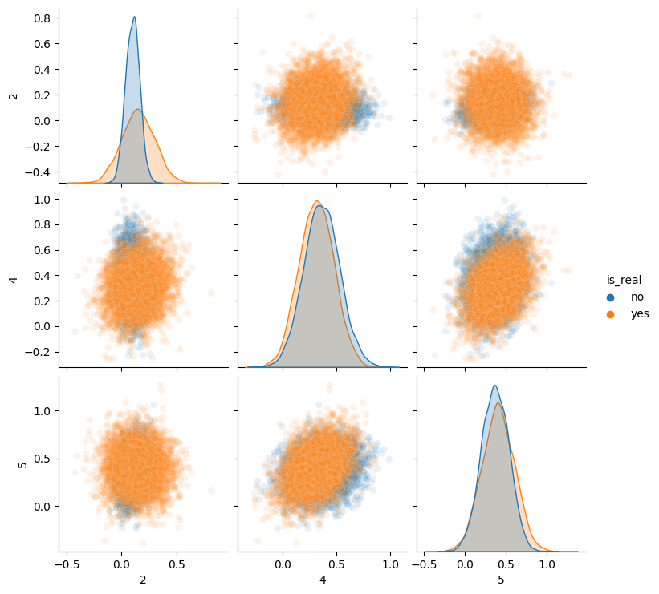

# Frechet Inception Distance (FID) for GAN Evaluation

This repository contains code for implementing the Frechet Inception Distance (FID) for evaluating Generative Adversarial Networks (GANs). FID is a popular metric for quantifying the quality and diversity of images generated by GANs. It measures the similarity between the distribution of real images and the distribution of generated images.

## Introduction

Generative Adversarial Networks (GANs) are widely used for generating realistic images. However, evaluating the performance of GANs is challenging. Traditional metrics like Inception Score have limitations in capturing the quality and diversity of generated images. The Frechet Inception Distance (FID) overcomes some of these limitations by comparing the activations of the Inception-v3 model on real and generated images.

In this project, I implement the FID metric to evaluate the performance of GANs. I calculate the FID by extracting features from the Inception-v3 model and then computing the Frechet distance between the feature distributions.

## Challenges With Evaluating GANs

#### Loss is Uninformative of Performance
One aspect that makes evaluating GANs challenging is that the loss tells us little about their performance. Unlike with classifiers, where a low loss on a test set indicates superior performance, a low loss for the generator or discriminator suggests that learning has stopped.

#### No Clear Non-human Metric
If you define the goal of a GAN as "generating images which look real to people" then it's technically possible to measure this directly: [you can ask people to act as a discriminator](https://arxiv.org/abs/1904.01121). However, this takes significant time and money so ideally you can use a proxy for this. There is also no "perfect" discriminator that can differentiate reals from fakes - if there were, a lot of machine learning tasks would be solved ;)

In this notebook, I will implement Fréchet Inception Distance, one method which aims to solve these issues.

## Visualizing Pairwise multivariate distributions of Inception features
At the end of notebook, after getting real and fake distributions of inception features, I observed the pairwise distributions. Following pair plot represents relationship among the features:

