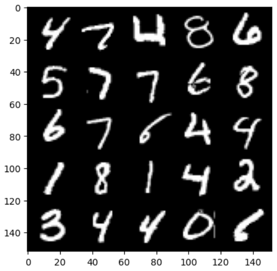

# SNGAN (Spectral Normalization Generative Adversarial Networks)

## Background

As its name suggests, SN-GAN normalizes the weight matrices in the discriminator by their corresponding [spectral norm](https://calculus.subwiki.org/wiki/Spectral_norm#:~:text=The%20spectral%20norm%20of%20a,where%20denotes%20the%20Euclidean%20norm.), which helps control the Lipschitz constant of the discriminator. As we know that with WGAN, [Lipschitz continuity](https://en.wikipedia.org/wiki/Lipschitz_continuity) is important in ensuring the boundedness of the optimal discriminator. In the WGAN case, this makes it so that the underlying W-loss function for the discriminator (or more precisely, the critic) is valid.

As a result, spectral normalization helps improve stability and avoid vanishing gradient problems, such as mode collapse.

## About

SNGAN is an extension of the original Generative Adversarial Network (GAN) architecture that addresses some of the challenges in training GANs, such as mode collapse and instability. The key modification in SNGAN is the introduction of spectral normalization in the discriminator network.

Spectral normalization is a technique that normalizes the spectral norm of weight matrices in the discriminator. It constrains the Lipschitz constant of the discriminator, which helps stabilize the adversarial training process. By applying spectral normalization, SNGAN encourages the discriminator to provide better gradient signals to the generator, leading to more stable and higher-quality image generation.

This folder provides an implementation of SNGAN using the PyTorch deep learning framework. It includes both the generator and discriminator networks, along with the necessary training code to train the model on your own dataset. Following is the detail of architecture involved:

## Generator
The generator, G, is designed to map the latent space vector (z) to data-space. Since our data are images, converting z to data-space means ultimately creating a RGB image with the same size as the training images (i.e. 3x64x64). In practice, this is accomplished through a series of strided two dimensional convolutional transpose layers, each paired with a 2d batch norm layer and a relu activation. The output of the generator is fed through a tanh function to return it to the input data range of [−1,1]. 

## Discriminator

For the discriminator, I wrapped each `nn.Conv2d` with `nn.utils.spectral_norm`. In the backend, this introduces parameters for $\tilde{u}$ and $\tilde{v}$ in addition to $W$ so that the $W_{SN}$ can be computed as $\tilde{u}^\top W\tilde{v}$ in runtime.

Pytorch also provides a `nn.utils.remove_spectral_norm` function, which collapses the 3 separate parameters into a single explicit $\overline{W}_{SN} := \tilde{u}^\top W\tilde{v}$. You should only apply this to your convolutional layers during inference to improve runtime speed.

It is important note that spectral norm does not eliminate the need for batch norm. Spectral norm affects the weights of each layer, while batch norm affects the activations of each layer. You can see both in a discriminator architecture, but you can also see just one of them. Hope this is something you have fun experimenting with!

## Results

I trained the GAN for 50 epochs over the MNIST dataset. On inputting random noise vectors, following are the fake images generated by the model after training: 

