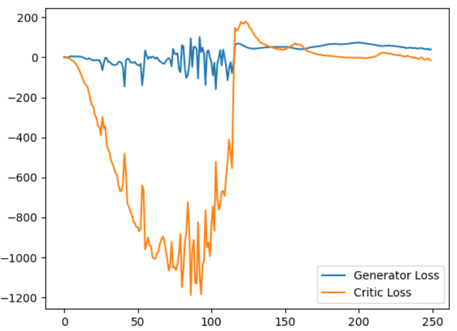

# WGAN-GP (Wasserstein Generative Adversarial Networks with Gradient Penalty)

## Background

WGAN, short for Wasserstein Generative Adversarial Network, is an extension of the original Generative Adversarial Network (GAN) architecture that introduces the Wasserstein distance as a loss function. WGAN addresses some of the challenges faced by traditional GANs, such as mode collapse and instability during training.

The key concept behind WGAN is the use of the Wasserstein distance (also known as Earth Mover's distance) as a metric to measure the dissimilarity between the true data distribution and the generated data distribution. By optimizing the Wasserstein distance, WGAN encourages the generator to produce samples that are closer to the real data distribution, leading to more realistic and diverse generated outputs.

## About

This folder contains an implementation of WGAN using the PyTorch deep learning framework. It includes both the generator and discriminator networks, along with the necessary training code to train the model on your own dataset.

Following is the detail of architecture involved:

## Generator
The generator, G, is designed to map the latent space vector (z) to data-space. Since our data are images, converting z to data-space means ultimately creating a RGB image with the same size as the training images (i.e. 3x64x64). In practice, this is accomplished through a series of strided two dimensional convolutional transpose layers, each paired with a 2d batch norm layer and a relu activation. The output of the generator is fed through a tanh function to return it to the input data range of [−1,1]. 

## Discriminator

The discriminator, D, is a binary classification network that takes an image as input and outputs a scalar probability that the input image is real (as opposed to fake). Here, D takes a 3x64x64 input image, processes it through a series of Conv2d, BatchNorm2d, and LeakyReLU layers, and outputs the final probability through a Sigmoid activation function.

## Loss Function:
I used Wasserstein loss function and enforced 1-Lipschitz continuity on discriminator weights using gradient clipping. As a result of which, problems of traditional GANs such as mode collapse and vanishing gradients were resolved.

## Results

I trained WGAN for 50 epochs over the MNIST dataset. Following is the progress of losses of generator and discriminator during training:

After training, on inputing random noise vectors, following were the fake images generated by the model: 

